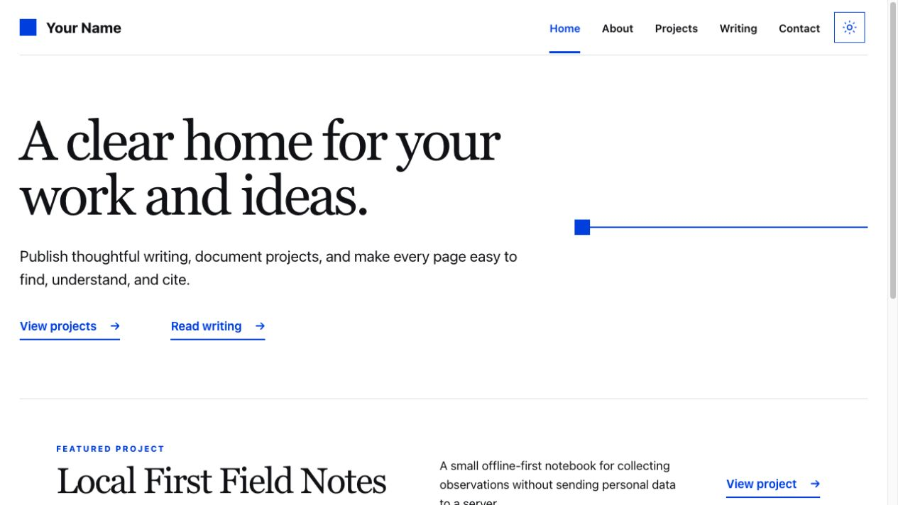

# Agent-ready personal site template

A fast, accessible Next.js template for publishing projects and writing for people, search engines, LLMs, and web agents.

[View the live demo](https://agent-ready-site-template.vercel.app) · [Use this template](https://github.com/sergiopesch/my-site-template/generate)



## What you get

- Static project and writing pages built from validated Markdown
- Canonical URLs, aliases, Open Graph metadata, and JSON-LD
- Markdown alternates, RSS, JSON Feed, sitemap, `llms.txt`, and a content index
- Accessible responsive layouts, dark mode, and secure response headers
- Draft and private repository protection across every public output
- Unit, browser, accessibility, metadata, and machine-output tests

This is a publishing foundation, not a chatbot or agent runtime. It needs no database, model dependency, analytics service, or request-time content fetch.

## Quick start

1. Select **Use this template** on GitHub and clone your new repository.
2. Use Node 22 and install the locked dependencies.

   ```bash
   nvm use
   npm ci
   ```

3. Edit [`config/site.ts`](config/site.ts) with your identity, links, language, and production URL.
4. Replace the examples in `content/projects` and `content/posts`.
5. Generate, validate, and start the site.

   ```bash
   npm run generate:machine
   npm run check
   npm run test:e2e
   npm run dev
   ```

## Publishing outputs

All human and machine-readable formats come from the same validated content catalog:

- `/projects/:slug` and `/writing/:slug`
- `/projects/:slug.md` and `/writing/:slug.md`
- `/llms.txt` and `/llms-full.txt`
- `/content-index.json`, `/feed.json`, and `/rss.xml`
- `/sitemap.xml` and `/robots.txt`

Do not edit generated files in `public/` by hand. Run `npm run generate:machine` after content changes.

## Deploy

Set `NEXT_PUBLIC_SITE_URL` to your stable production origin. Vercel can deploy the repository directly using the included configuration; other Node hosts can run `npm ci`, `npm run build`, and `npm run start`.

See [SECURITY.md](SECURITY.md) for security reporting and [CONTRIBUTING.md](CONTRIBUTING.md) for contribution guidance. The template code is available under the [MIT License](LICENSE).
